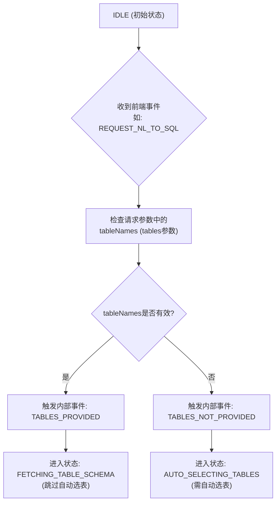
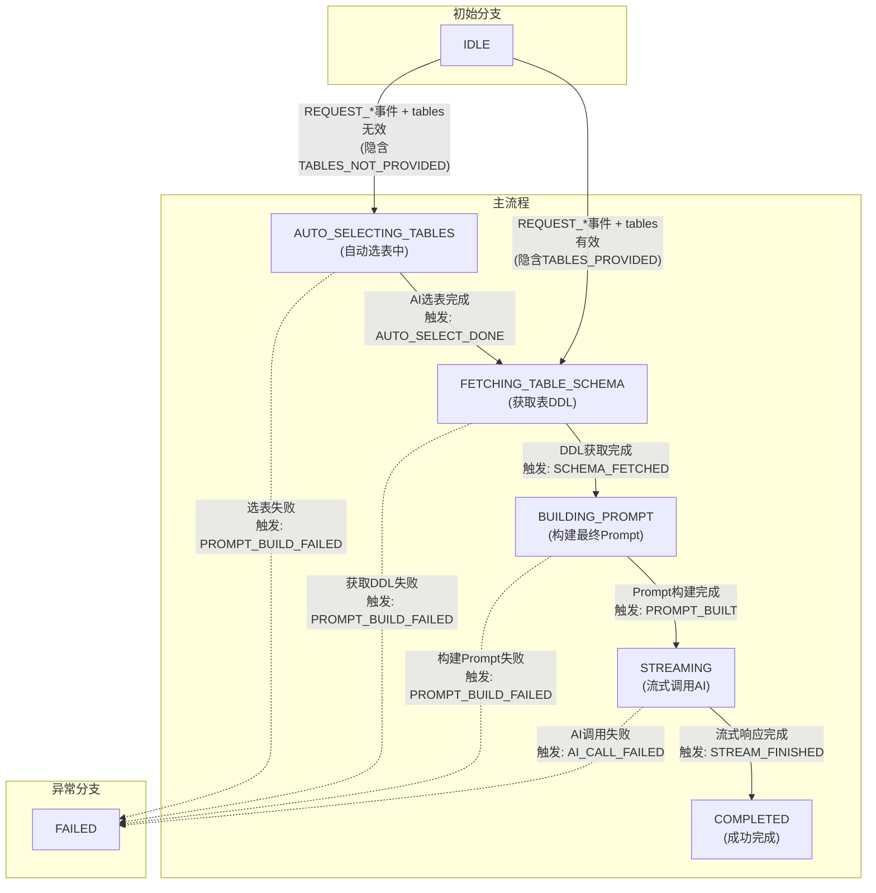
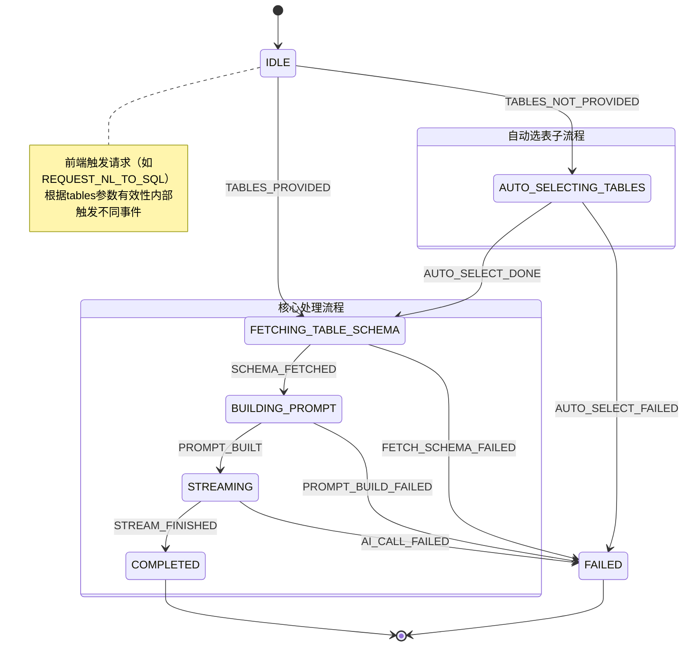

# Prompt处理状态机：事件分支逻辑与完整流程图

## 一、设计理念

基于“前端触发事件，后端状态自动流转”的架构，事件（Event）代表用户或系统的明确**动作或指令**，状态（State）代表系统当前所处的**处理阶段**。状态机根据接收到的事件和当前状态，结合守卫条件，自动决定下一个状态并执行业务逻辑。

## 二、事件（Event）体系完整定义

### 2.1 用户发起的主要指令事件

这些事件对应前端可触发的各类`PromptType`请求。

| 事件                          | 对应PromptType     | 触发方 | 含义与携带信息                                               |
| ----------------------------- | ------------------ | ------ | ------------------------------------------------------------ |
| **`REQUEST_NL_TO_SQL`**       | `NL_2_SQL`         | 前端   | 请求将自然语言转换为SQL。需携带`message`（自然语言问题）。   |
| **`REQUEST_EXPLAIN_SQL`**     | `SQL_EXPLAIN`      | 前端   | 请求解释SQL语句。需携带`message`（SQL语句）。                |
| **`REQUEST_OPTIMIZE_SQL`**    | `SQL_OPTIMIZER`    | 前端   | 请求优化SQL语句。需携带`message`（SQL语句）。                |
| **`REQUEST_CONVERT_SQL`**     | `SQL_2_SQL`        | 前端   | 请求转换SQL方言。需携带`message`（SQL语句）和`destSqlType`（目标数据库类型）。 |
| **`REQUEST_TEXT_GENERATION`** | `TEXT_GENERATION`  | 前端   | 请求直接进行文本生成。需携带`message`（任何文本）。          |
| **`REQUEST_GENERATE_TITLE`**  | `TITLE_GENERATION` | 前端   | 请求为查询生成标题。需携带`message`（查询语句或描述）。      |
| **`REQUEST_GUESS_COMMENT`**   | `NL_2_COMMENT`     | 前端   | 请求猜测表/字段注释。需携带`message`（表名、字段名或SQL）。  |

**关键属性**：所有上述事件均隐含一个由前端通过`tables`请求参数传递的**`tableNames`列表**。此属性是驱动核心分支逻辑的关键。

### 2.2 系统内部决策与处理事件

这些事件通常由状态机在特定状态的**动作（Action）** 或**守卫（Guard）** 中自动触发，而非前端直接调用。

| 事件                      | 触发条件                                                     | 含义与作用                                   |
| ------------------------- | ------------------------------------------------------------ | -------------------------------------------- |
| **`TABLES_PROVIDED`**     | 守卫`hasTablesGuard()`检测到`tableNames`列表有效（非空）。   | 表示用户已明确提供表名，流程应跳过自动选表。 |
| **`TABLES_NOT_PROVIDED`** | 守卫`hasTablesGuard()`检测到`tableNames`列表无效（空或未提供）。 | 表示用户未提供表名，流程需进入自动选表阶段。 |
| **`AUTO_SELECT_DONE`**    | 在`AUTO_SELECTING_TABLES`状态中，AI自动选表逻辑完成。        | 驱动状态离开“自动选表”状态，进入下一阶段。   |
| **`SCHEMA_FETCHED`**      | 在`FETCHING_TABLE_SCHEMA`状态中，成功获取到指定表的DDL信息。 | 驱动状态进入Prompt构建阶段。                 |
| **`PROMPT_BUILT`**        | 在`BUILDING_PROMPT`状态中，最终Prompt构建完成。              | 驱动状态进入AI流式调用阶段。                 |
| **`STREAM_FINISHED`**     | 在`STREAMING`状态中，AI流式响应全部完成。                    | 驱动状态进入完成终态。                       |
| **`PROMPT_BUILD_FAILED`** | 在`BUILDING_PROMPT`等状态中，构建Prompt时发生错误。          | 驱动状态进入错误终态。                       |
| **`AI_CALL_FAILED`**      | 在`STREAMING`状态中，调用AI服务失败。                        | 驱动状态进入错误终态。                       |

## 三、核心分支逻辑详解

状态机的分支逻辑主要由**初始路由决策**和**后续自动流转**两部分构成。

### 3.1 初始路由决策（基于`tables`参数）

这是最主要的分支点，发生在状态机从`IDLE`状态接收到任意一个`REQUEST_*`事件时。

**逻辑说明**：

1. **分支条件**：取决于前端请求中`tables`参数是否提供了有效的表名列表。
2. **分支动作**：此决策由一个**守卫（Guard）** 实现。守卫检查`tableNames`属性，并自动触发相应的内部事件（`TABLES_PROVIDED`或`TABLES_NOT_PROVIDED`），从而驱动状态机进入不同的下一个状态。
3. **结果**：
   - **有效**：直接进入`FETCHING_TABLE_SCHEMA`，流程最短。
   - **无效**：进入`AUTO_SELECTING_TABLES`，启动AI选表子流程。

### 3.2 后续自动流转路径

初始分支之后，状态机将沿着预设路径自动运行，直至完成。

**路径说明**：

1. **自动选表路径**：`IDLE`-> `AUTO_SELECTING_TABLES`-> `FETCHING_TABLE_SCHEMA`-> ...
2. **直连路径**：`IDLE`-> `FETCHING_TABLE_SCHEMA`-> ...
3. **共同路径**：两条路径在`FETCHING_TABLE_SCHEMA`状态汇合，之后的流程完全一致：获取DDL -> 构建Prompt -> 流式输出 -> 完成。
4. **异常路径**：在任何非终态，如果对应的业务操作失败，应触发相应的失败事件（如`PROMPT_BUILD_FAILED`），使状态机跳转到`FAILED`终态，便于统一错误处理。

## 四、完整状态转换图 (Mermaid)

以下图表综合了所有状态、事件和分支逻辑。

**图例解读**：

1. **实线箭头**：代表正常的状态转换，由对应的事件触发。
2. **虚线箭头**：代表异常的状态转换，由失败事件触发。
3. **注释框**：解释了在`IDLE`状态，同一个前端事件如何通过守卫产生不同的内部事件，进而实现分支。
4. **状态分组**：将“自动选表”和“核心处理”分别用子状态框表示，突出了流程的模块化。