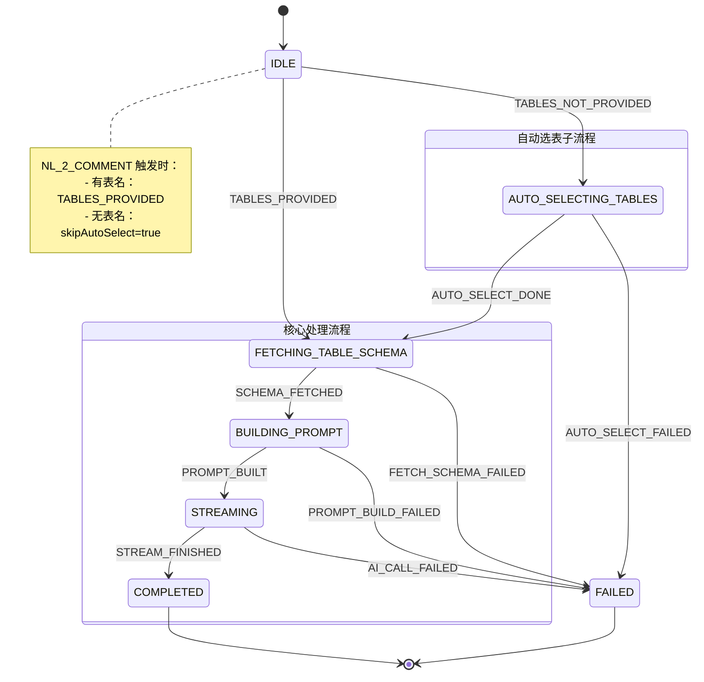
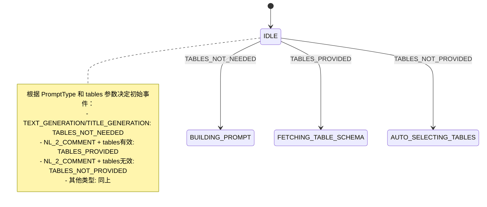
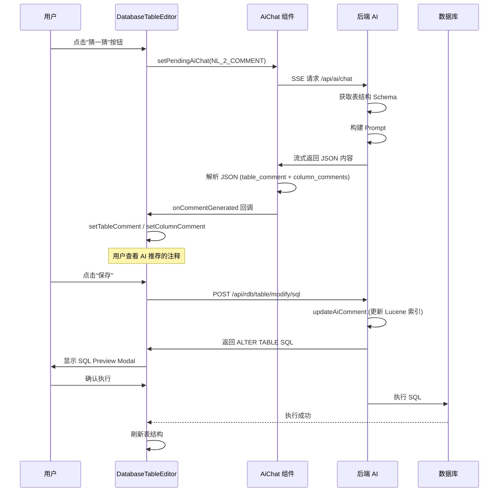
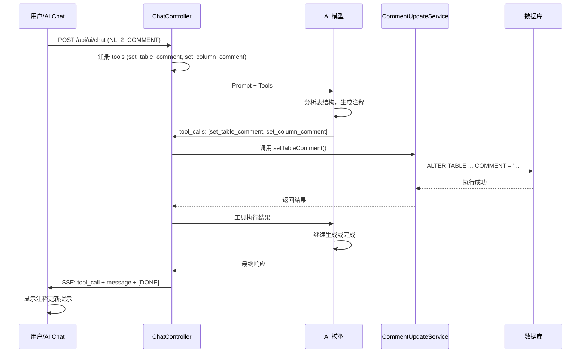

# NL_2_COMMENT（猜一猜）功能重构方案

> 版本：v1.0  
> 日期：2026-04-12  
> 状态：待实施

---

## 一、功能概述

### 1.1 功能定义

**NL_2_COMMENT** 是 Chat2DB 的"猜一猜"功能，用于 AI 自动生成表和字段的中文注释，帮助用户快速理解数据库结构。

### 1.2 当前问题

| 问题 | 严重程度 | 影响 |
|------|----------|------|
| **Function Call 机制缺失** | 🔴 高 | 前端期望的 `set_table_comment`/`set_column_comment` 无法触发，注释无法自动更新 |
| **前端重复实现** | 🔴 高 | DatabaseTableEditor 没有使用 AiChat 组件，独立实现 EventSource 逻辑 |
| **类型定义分散** | 🟡 中 | DatabaseTableEditor 本地定义 IPromptType，与后端不一致 |
| **后端分类混乱** | 🟡 中 | NL_2_COMMENT 被归类为 `skipAutoSelect`，但 schema 获取逻辑不一致 |

---

## 二、当前架构分析

### 2.1 前端架构

#### 两个独立的 AI 功能入口

**1. AiChat 组件** (`src/components/AiChat/index.tsx`)

- 通用 AI 聊天界面
- 支持状态机状态显示（选表、获取 schema、构建 prompt、流式输出）
- 通过 `pendingAiChat` 机制从其他组件触发
- 支持的 PromptType：`NL_2_SQL` | `SQL_EXPLAIN` | `SQL_OPTIMIZER` | `SQL_2_SQL`
- **没有 tool_calls 处理逻辑**

**2. DatabaseTableEditor 内置 guess()** (`src/blocks/DatabaseTableEditor/index.tsx`)

- 编辑表时的"猜一猜"按钮
- 独立实现 EventSource 连接
- 有 `onCallback` 期望处理 `set_table_comment` 和 `set_column_comment`
- **但后端不支持 Function Call，此逻辑永不触发**

#### 相关文件

```
前端文件清单：
├── src/components/AiChat/index.tsx           # AI 聊天组件（通用）
├── src/blocks/DatabaseTableEditor/index.tsx  # 表编辑器 + 独立 guess()
├── src/pages/main/workspace/store/common.ts  # IAiChatPromptType 类型定义
├── src/pages/main/workspace/store/aiChatStore.ts  # AI Chat 状态管理
├── src/utils/eventSource.ts                  # SSE 连接工具
└── src/service/sql.ts                        # API 服务层
```

### 2.2 后端架构

#### 状态机流程



#### 关键代码分析

**1. PromptType.java** - 枚举定义
```java
NL_2_COMMENT("猜测表和字段注释")
```

**2. ChatController.java** - 初始事件决策
```java
private ChatEvent determineInitialEvent(ChatQueryRequest request) {
    boolean skipAutoSelect = PromptType.NL_2_COMMENT.getCode().equals(request.getPromptType())
        || PromptType.TITLE_GENERATION.getCode().equals(request.getPromptType())
        || PromptType.TEXT_GENERATION.getCode().equals(request.getPromptType());
    return (hasTables || skipAutoSelect) ? ChatEvent.TABLES_PROVIDED : ChatEvent.TABLES_NOT_PROVIDED;
}
```

**3. FetchSchemaAction.java** - Schema 获取逻辑
```java
private boolean isTextGeneration(ChatQueryRequest request) {
    return PromptType.TEXT_GENERATION.getCode().equals(request.getPromptType())
            || PromptType.TITLE_GENERATION.getCode().equals(request.getPromptType());
}
// 注意：NL_2_COMMENT 不在 isTextGeneration 中，会正常获取 schema
```

**4. prompt-templates.yml** - 提示词模板
```yaml
nl_2_comment:
  name: "nl_2_comment"
  description: "猜测表和字段注释"
  template: |
    ### 请根据以下 table properties 和 SQL input{description}. {ext}
    #
    ### {db_type} SQL tables, with their properties:
    #
    # {schema}
    #
    ### 猜测表和字段注释
```

#### 相关文件

```
后端文件清单：
├── chat2db-server-web-api/src/main/java/ai/chat2db/server/web/api/controller/ai/
│   ├── ChatController.java                    # 聊天入口
│   ├── enums/PromptType.java                  # Prompt 类型枚举
│   ├── request/ChatQueryRequest.java          # 请求参数
│   ├── prompt/
│   │   ├── PromptTemplate.java                # 模板值对象
│   │   ├── PromptContext.java                 # 构建上下文
│   │   ├── PromptBuilderImpl.java             # 提示词构建器
│   │   └── PromptTemplateRegistry.java        # 模板注册表
│   └── statemachine/
│       ├── ChatState.java                     # 状态枚举
│       ├── ChatEvent.java                     # 事件枚举
│       ├── ChatContext.java                   # 状态机上下文
│       ├── ChatStateMachineConfig.java        # 状态机配置
│       └── actions/
│           ├── BaseChatAction.java            # Action 基类
│           ├── SelectTablesAction.java        # 自动选表
│           ├── FetchSchemaAction.java         # 获取 schema
│           ├── BuildPromptAction.java         # 构建 prompt
│           └── StreamAction.java              # 流式输出
├── chat2db-server-web-api/src/main/resources/
│   └── prompt-templates.yml                   # 提示词模板配置
└── chat2db-server-domain-api/src/main/java/ai/chat2db/server/domain/api/service/
    ├── TableService.java                      # 表服务接口
    └── DatabaseService.java                   # 数据库服务接口
```

---

### 2.3 状态机优化（已实施）

#### 问题分析

原有的状态机初始事件决策逻辑存在问题：

- `NL_2_COMMENT` 被归类为 `skipAutoSelect`（与 `TEXT_GENERATION`、`TITLE_GENERATION` 混在一起）
- `TEXT_GENERATION` 和 `TITLE_GENERATION` 真正不需要表信息，却仍会进入 `FETCHING_TABLE_SCHEMA` 状态
- `FetchSchemaAction` 中有 `isTextGeneration` 判断来处理不需要 schema 的情况，增加了复杂度

#### 优化方案

新增 `TABLES_NOT_NEEDED` 事件，让 `TEXT_GENERATION` 和 `TITLE_GENERATION` 直接跳过选表和获取 schema 的流程：



#### 已完成的修改

| 文件 | 修改内容 |
|------|----------|
| `ChatEvent.java` | 新增 `TABLES_NOT_NEEDED` 事件 |
| `ChatStateMachineConfig.java` | 新增 `IDLE -> BUILDING_PROMPT` 状态转换 |
| `ChatController.java` | 重构 `determineInitialEvent` 方法 |
| `FetchSchemaAction.java` | 移除 `isTextGeneration` 判断 |

#### 修改后的代码

**ChatController.java - determineInitialEvent 方法：**

```java
private ChatEvent determineInitialEvent(ChatQueryRequest request) {
    boolean hasTables = CollectionUtils.isNotEmpty(request.getTableNames());
    
    String promptType = request.getPromptType();
    
    // TEXT_GENERATION 和 TITLE_GENERATION 不需要表信息
    if (PromptType.TEXT_GENERATION.getCode().equals(promptType)
            || PromptType.TITLE_GENERATION.getCode().equals(promptType)) {
        return ChatEvent.TABLES_NOT_NEEDED;
    }
    
    // NL_2_COMMENT 需要表结构信息
    if (PromptType.NL_2_COMMENT.getCode().equals(promptType)) {
        return hasTables ? ChatEvent.TABLES_PROVIDED : ChatEvent.TABLES_NOT_PROVIDED;
    }
    
    // 其他类型根据是否有表名决定
    return hasTables ? ChatEvent.TABLES_PROVIDED : ChatEvent.TABLES_NOT_PROVIDED;
}
```

**FetchSchemaAction.java - 简化后的逻辑：**

```java
private String fetchSchemaDdl(ChatContext ctx) {
    ChatQueryRequest request = ctx.getRequest();

    // TEXT_GENERATION/TITLE_GENERATION 已经不会进入此状态了
    if (hasTableNames(request)) {
        return queryTablesWithNames(request);
    } else {
        return queryAllTables(request);
    }
}
```

---

## 三、重构方案详解（修订版）

### 方案选择：结构化 JSON 输出 + 用户确认流程

#### 方案优势

✅ **不需要 Function Call** - 后端改动最小  
✅ **用户先查看再确认** - 更安全，避免误操作  
✅ **与现有流程一致** - 使用 `/modify/sql` + `updateAiComment`  
✅ **前端改动小** - 只需解析 JSON 并调用 `setTableComment`/`setColumnComment`

#### 流程说明



---

## 四、已完成的修改

### 4.1 状态机优化

新增 `TABLES_NOT_NEEDED` 事件，优化初始路由决策：

| PromptType | 初始事件 | 流程 |
|------------|----------|------|
| `TEXT_GENERATION` / `TITLE_GENERATION` | `TABLES_NOT_NEEDED` | 直接构建 Prompt |
| `NL_2_COMMENT` + 有表名 | `TABLES_PROVIDED` | 获取 Schema → 构建 Prompt |
| `NL_2_COMMENT` + 无表名 | `TABLES_NOT_PROVIDED` | 自动选表 → 获取 Schema → 构建 Prompt |

### 4.2 Prompt 模板修改

**文件：** `prompt-templates.yml`

修改 `NL_2_COMMENT` 模板，要求 AI 返回 JSON 格式：

```yaml
nl_2_comment:
  template: |
    ### 任务：为表和字段生成合适的中文注释
    
    **输出格式要求（严格遵守 JSON 格式）：**
    
    ```json
    {
      "table_comment": "表的注释内容",
      "column_comments": [
        {
          "column_name": "字段名1",
          "comment": "字段1的注释内容"
        }
      ]
    }
    ```
    
    只输出 JSON 内容，不要包含其他解释文字
```

### 4.3 前端修改

#### 修改的文件

| 文件 | 修改内容 |
|------|----------|
| `common.ts` | 扩展 `IAiChatPromptType` 添加 `NL_2_COMMENT`，新增 `ITableCommentResult` 接口，`IPendingAiChat` 添加 `onCommentGenerated` 回调 |
| `AiChat/index.tsx` | 在 COMPLETED 状态解析 JSON，调用 `onCommentGenerated` 回调 |
| `DatabaseTableEditor/index.tsx` | 删除本地 guess() 函数，改用 pendingAiChat 机制触发 AiChat |

#### 关键代码片段

**common.ts - 类型定义：**

```typescript
export type IAiChatPromptType = 'NL_2_SQL' | 'SQL_EXPLAIN' | 'SQL_OPTIMIZER' | 'SQL_2_SQL' | 'NL_2_COMMENT';

export interface ITableCommentResult {
  table_comment: string;
  column_comments: IColumnComment[];
}

export interface IPendingAiChat {
  dataSourceId: number;
  databaseName?: string;
  schemaName?: string | null;
  message: string;
  promptType: IAiChatPromptType;
  onCommentGenerated?: (result: ITableCommentResult) => void;
}
```

**AiChat/index.tsx - JSON 解析和回调：**

```typescript
function extractJsonFromContent(content: string): ITableCommentResult | null {
  const jsonMatch = content.match(/\{[\s\S]*"table_comment"[\s\S]*"column_comments"[\s\S]*\}/);
  if (jsonMatch) {
    return JSON.parse(jsonMatch[0]);
  }
  return null;
}

// 在 onDone 中：
if (promptType === 'NL_2_COMMENT' && commentCallbackRef.current) {
  const jsonContent = extractJsonFromContent(session.currentContent);
  if (jsonContent) {
    commentCallbackRef.current(jsonContent);
  }
}
```

**DatabaseTableEditor/index.tsx - 使用 AiChat：**

```typescript
const handleCommentGenerated = useCallback((result: ITableCommentResult) => {
  if (result.table_comment) {
    baseInfoRef.current?.setTableComment(result.table_comment);
  }
  if (result.column_comments) {
    result.column_comments.forEach((col) => {
      columnListRef.current?.setColumnComment(col.column_name, col.comment);
    });
  }
}, []);

const openAiChatForGuess = useCallback(() => {
  setPendingAiChat({
    dataSourceId,
    databaseName,
    schemaName,
    message: `请为表 ${tableName} 及其所有字段生成合适的中文注释`,
    promptType: 'NL_2_COMMENT',
    onCommentGenerated: handleCommentGenerated,
  });
  setCurrentWorkspaceExtend('ai');
}, [dataSourceId, databaseName, schemaName, tableName]);
```

---

## 五、预期效果

### 功能层面

✅ **猜一猜功能正常工作** - AI 生成 JSON 格式注释，前端解析并应用  
✅ **用户先查看再确认** - 注释先显示在表单中，用户确认后再保存  
✅ **前后端统一** - AiChat 成为唯一的 AI 交互入口  
✅ **与现有流程一致** - 使用 `/modify/sql` + `updateAiComment`

### 技术层面

✅ **代码简洁** - 删除了 DatabaseTableEditor 中重复的 EventSource 逻辑  
✅ **架构清晰** - 使用 pendingAiChat 机制统一触发 AI 功能  
✅ **易于维护** - 单一入口，统一管理

### 方案选择：Function Call 机制（推荐）

#### 方案优势

✅ **符合 AI 原生设计理念** - OpenAI、Spring AI 均支持 Function Calling  
✅ **结构化数据传递** - 避免文本解析错误  
✅ **易于扩展** - 可轻松添加更多 AI 工具函数  
✅ **技术成熟** - Spring AI 已完整支持 Function Calling  
✅ **前后端解耦** - 前端只需处理 SSE 事件，后端负责执行

---

## 四、详细实施步骤

### 第一阶段：后端实现（Prioritized）

#### Step 1：创建 Function Call 定义类

**文件：** `chat2db-server-web-api/src/main/java/ai/chat2db/server/web/api/controller/ai/function/CommentFunctionDefinitions.java`

```java
package ai.chat2db.server.web.api.controller.ai.function;

import org.springframework.ai.tool.ToolCallbackProvider;
import org.springframework.ai.tool.definition.ToolDefinition;
import org.springframework.stereotype.Component;

import java.util.List;
import java.util.Map;

/**
 * 注释更新相关的 Function Call 定义
 * 
 * 用于 AI 模型调用，实现自动更新表/列注释
 */
@Component
public class CommentFunctionDefinitions implements ToolCallbackProvider {

    @Override
    public List<ToolDefinition> getToolDefinitions() {
        return List.of(
            // 设置表注释
            ToolDefinition.builder()
                .name("set_table_comment")
                .description("设置表的注释。参数：table_name（表名）、comment（注释内容）")
                .inputSchema(Map.of(
                    "type", "object",
                    "properties", Map.of(
                        "table_name", Map.of(
                            "type", "string", 
                            "description", "要设置注释的表名"
                        ),
                        "comment", Map.of(
                            "type", "string", 
                            "description", "注释内容，简洁准确的中文描述"
                        )
                    ),
                    "required", List.of("table_name", "comment")
                ))
                .build(),
                
            // 设置列注释
            ToolDefinition.builder()
                .name("set_column_comment")
                .description("设置列的注释。参数：table_name（表名）、column_name（列名）、comment（注释内容）")
                .inputSchema(Map.of(
                    "type", "object",
                    "properties", Map.of(
                        "table_name", Map.of(
                            "type", "string", 
                            "description", "所属表名"
                        ),
                        "column_name", Map.of(
                            "type", "string", 
                            "description", "要设置注释的列名"
                        ),
                        "comment", Map.of(
                            "type", "string", 
                            "description", "注释内容，简洁准确的中文描述"
                        )
                    ),
                    "required", List.of("table_name", "column_name", "comment")
                ))
                .build()
        );
    }
}
```

#### Step 2：创建注释更新服务实现

**文件：** `chat2db-server-domain-core/src/main/java/ai/chat2db/server/domain/core/impl/CommentUpdateServiceImpl.java`

```java
package ai.chat2db.server.domain.core.impl;

import org.springframework.ai.tool.annotation.Tool;
import org.springframework.beans.factory.annotation.Autowired;
import org.springframework.stereotype.Service;

import ai.chat2db.server.domain.api.param.CommentUpdateParam;
import ai.chat2db.server.domain.api.service.TableService;
import lombok.extern.slf4j.Slf4j;

/**
 * 注释更新服务实现
 * 
 * 提供 AI Function Call 调用的工具方法
 * Spring AI 会自动调用这些方法来执行 Function
 */
@Service
@Slf4j
public class CommentUpdateServiceImpl {

    @Autowired
    private TableService tableService;

    /**
     * 设置表注释（AI 工具函数）
     * 
     * Spring AI 会在 AI 模型返回 set_table_comment 调用时自动执行此方法
     * 
     * @param tableName 表名
     * @param comment 注释内容
     */
    @Tool(description = "设置表的注释")
    public void setTableComment(String tableName, String comment) {
        log.info("[AI Tool] Setting table comment: table={}, comment={}", tableName, comment);
        
        CommentUpdateParam param = CommentUpdateParam.builder()
            .tableName(tableName)
            .comment(comment)
            .build();
        
        tableService.updateTableComment(param);
        
        log.info("[AI Tool] Table comment updated successfully: table={}", tableName);
    }

    /**
     * 设置列注释（AI 工具函数）
     * 
     * Spring AI 会在 AI 模型返回 set_column_comment 调用时自动执行此方法
     * 
     * @param tableName 所属表名
     * @param columnName 列名
     * @param comment 注释内容
     */
    @Tool(description = "设置列的注释")
    public void setColumnComment(String tableName, String columnName, String comment) {
        log.info("[AI Tool] Setting column comment: table={}, column={}, comment={}", 
            tableName, columnName, comment);
        
        CommentUpdateParam param = CommentUpdateParam.builder()
            .tableName(tableName)
            .columnName(columnName)
            .comment(comment)
            .build();
        
        tableService.updateColumnComment(param);
        
        log.info("[AI Tool] Column comment updated successfully: table={}, column={}", 
            tableName, columnName);
    }
}
```

#### Step 3：扩展 TableService 接口

**文件：** `chat2db-server-domain-api/src/main/java/ai/chat2db/server/domain/api/service/TableService.java`

```java
// 在现有接口中添加以下方法

/**
 * 更新表注释
 * 
 * @param param 更新参数，包含 tableName、comment
 */
void updateTableComment(CommentUpdateParam param);

/**
 * 更新列注释
 * 
 * @param param 更新参数，包含 tableName、columnName、comment
 */
void updateColumnComment(CommentUpdateParam param);
```

#### Step 4：创建参数类

**文件：** `chat2db-server-domain-api/src/main/java/ai/chat2db/server/domain/api/param/CommentUpdateParam.java`

```java
package ai.chat2db.server.domain.api.param;

import lombok.AllArgsConstructor;
import lombok.Builder;
import lombok.Data;
import lombok.NoArgsConstructor;

/**
 * 注释更新参数
 */
@Data
@Builder
@NoArgsConstructor
@AllArgsConstructor
public class CommentUpdateParam {
    
    /**
     * 表名
     */
    private String tableName;
    
    /**
     * 列名（更新列注释时必填）
     */
    private String columnName;
    
    /**
     * 注释内容
     */
    private String comment;
    
    /**
     * 数据源ID（可选，从上下文获取）
     */
    private Long dataSourceId;
    
    /**
     * 数据库名（可选，从上下文获取）
     */
    private String databaseName;
    
    /**
     * Schema名（可选，从上下文获取）
     */
    private String schemaName;
}
```

#### Step 5：实现 TableService 方法

**文件：** `chat2db-server-domain-core/src/main/java/ai/chat2db/server/domain/core/impl/TableServiceImpl.java`

```java
// 在现有实现类中添加以下方法

@Autowired
private TableMapper tableMapper;  // 或其他数据库访问层

@Override
public void updateTableComment(CommentUpdateParam param) {
    // 构建更新表注释的 SQL
    String sql = buildUpdateTableCommentSql(param);
    
    // 执行 SQL
    executeUpdateSql(sql);
}

@Override
public void updateColumnComment(CommentUpdateParam param) {
    // 构建更新列注释的 SQL
    String sql = buildUpdateColumnCommentSql(param);
    
    // 执行 SQL
    executeUpdateSql(sql);
}

private String buildUpdateTableCommentSql(CommentUpdateParam param) {
    // 根据数据库类型生成不同的 SQL
    // MySQL: ALTER TABLE table_name COMMENT = 'comment';
    // PostgreSQL: COMMENT ON TABLE table_name IS 'comment';
    // ...
    return String.format("ALTER TABLE %s COMMENT = '%s'", 
        param.getTableName(), 
        escapeComment(param.getComment()));
}

private String buildUpdateColumnCommentSql(CommentUpdateParam param) {
    // 根据数据库类型生成不同的 SQL
    // MySQL: ALTER TABLE table_name MODIFY COLUMN column_name ... COMMENT 'comment';
    // PostgreSQL: COMMENT ON COLUMN table_name.column_name IS 'comment';
    // ...
    return String.format("ALTER TABLE %s MODIFY COLUMN %s ... COMMENT '%s'", 
        param.getTableName(), 
        param.getColumnName(),
        escapeComment(param.getComment()));
}

private String escapeComment(String comment) {
    // 转义注释中的特殊字符
    return comment.replace("'", "\\'");
}
```

#### Step 6：修改 ChatController 注册 Function

**文件：** `chat2db-server-web-api/src/main/java/ai/chat2db/server/web/api/controller/ai/ChatController.java`

```java
@RestController
@RequestMapping("/api/ai")
@Slf4j
public class ChatController {

    @Autowired
    private StateMachineFactory<ChatState, ChatEvent> stateMachineFactory;

    @Autowired
    private AiChatConfig aiChatConfig;
    
    @Autowired
    private CommentUpdateServiceImpl commentUpdateService;  // 新增依赖

    @GetMapping("/chat")
    public SseEmitter chat(ChatQueryRequest queryRequest, @RequestHeader Map<String, String> headers)
            throws IOException {
        String uid = headers.get("uid");
        if (StrUtil.isBlank(uid)) {
            throw new ParamBusinessException("uid");
        }

        log.info("[ChatController] Received uid from client: {}", uid);
        SseEmitter sseEmitter = new SseEmitter(CHAT_TIMEOUT);

        ChatClient chatClient = aiChatConfig.createChatClient();
        
        // 如果是 NL_2_COMMENT，启用 Function Call
        if (PromptType.NL_2_COMMENT.getCode().equals(queryRequest.getPromptType())) {
            log.info("[ChatController] NL_2_COMMENT request, registering function tools");
            chatClient = chatClient.mutate()
                .tools(commentUpdateService)  // 注册工具函数
                .build();
        }

        LoginUser loginUser = ContextUtils.getLoginUser();
        ConnectInfo connectInfo = Chat2DBContext.getConnectInfo().copy();

        ChatContext ctx = ChatContext.builder()
            .uid(uid)
            .request(queryRequest)
            .sseEmitter(sseEmitter)
            .chatClient(chatClient)  // 使用可能带有 tools 的 client
            .cancelled(false)
            .loginUser(loginUser)
            .connectInfo(connectInfo)
            .build();

        // ... 后续代码保持不变 ...
    }
}
```

#### Step 7：修改 StreamAction 支持 Tool Call 事件

**文件：** `chat2db-server-web-api/src/main/java/ai/chat2db/server/web/api/controller/ai/statemachine/actions/StreamAction.java`

```java
@Override
public void execute(StateContext<ChatState, ChatEvent> context) {
    log.info("[StreamAction] execute called");
    ChatContext ctx = getChatContext(context);
    
    if (ctx.isCancelled()) {
        return;
    }

    String prompt = ctx.getBuiltPrompt();

    if (!promptValidator.isValidLength(prompt)) {
        sendError(ctx.getSseEmitter(), "提示语超出最大长度");
        context.getStateMachine().sendEvent(
            MessageBuilder.withPayload(ChatEvent.AI_CALL_FAILED).build()
        );
        return;
    }

    try {
        sendStateEvent(ctx.getSseEmitter(), ChatState.STREAMING, "AI 正在生成...");
        
        // 注册工具函数
        Object tools = PromptType.NL_2_COMMENT.getCode().equals(ctx.getRequest().getPromptType())
            ? commentUpdateService
            : null;

        Flux<ChatResponse> flux = ctx.getChatClient().prompt()
                .user(prompt)
                .tools(tools)  // 如果有工具，注册到调用中
                .stream()
                .chatResponse();
        
        flux.publishOn(Schedulers.boundedElastic())
            .doOnNext(chatResponse -> {
                if (ctx.isCancelled()) {
                    throw new RuntimeException("Cancelled by user");
                }

                Generation generation = chatResponse.getResult();
                
                // 检查是否有 tool_calls（Function Call）
                if (generation.getMetadata() != null && 
                    generation.getMetadata().containsKey("tool_calls")) {
                    
                    @SuppressWarnings("unchecked")
                    List<Map<String, Object>> toolCalls = 
                        (List<Map<String, Object>>) generation.getMetadata().get("tool_calls");
                    
                    for (Map<String, Object> toolCall : toolCalls) {
                        sendToolCallEvent(ctx.getSseEmitter(), toolCall);
                    }
                    
                    // Function Call 后 AI 会继续生成，不立即返回
                    return;
                }

                // 正常内容处理
                JSONObject data = new JSONObject();
                String content = generation.getOutput().getText();
                String thinking = extractThinking(generation);

                if (content != null && !content.isEmpty()) {
                    data.put("content", content);
                }
                if (thinking != null && !thinking.isEmpty()) {
                    data.put("thinking", thinking);
                }

                if (!data.isEmpty()) {
                    try {
                        ctx.getSseEmitter().send(SseEmitter.event()
                            .id(ctx.getUid())
                            .name("message")
                            .data(data.toJSONString())
                            .reconnectTime(3000));
                    } catch (IOException e) {
                        throw new RuntimeException(e);
                    }
                }
            })
            .doOnError(error -> {
                log.error("[StreamAction] Stream error", error);
                if (!ctx.isCancelled()) {
                    sendError(ctx.getSseEmitter(), "AI 调用失败：" + error.getMessage());
                }
                context.getStateMachine().sendEvent(
                    MessageBuilder.withPayload(ChatEvent.AI_CALL_FAILED).build()
                );
            })
            .doOnComplete(() -> {
                log.info("[StreamAction] Stream completed");
                try {
                    ctx.getSseEmitter().send(SseEmitter.event()
                        .id("[DONE]")
                        .data("[DONE]")
                        .reconnectTime(3000));
                } catch (IOException ignored) {
                }
                ctx.getSseEmitter().complete();
                context.getStateMachine().sendEvent(
                    MessageBuilder.withPayload(ChatEvent.STREAM_FINISHED).build()
                );
            })
            .subscribe();

    } catch (Exception e) {
        log.error("[StreamAction] Start streaming failed", e);
        sendError(ctx.getSseEmitter(), "启动 AI 流式调用失败：" + e.getMessage());
        context.getStateMachine().sendEvent(
            MessageBuilder.withPayload(ChatEvent.AI_CALL_FAILED).build()
        );
    }
}

/**
 * 发送 tool_call 事件到前端
 */
private void sendToolCallEvent(SseEmitter emitter, Map<String, Object> toolCall) {
    try {
        JSONObject data = new JSONObject();
        data.put("type", "tool_call");
        data.put("name", toolCall.get("name"));
        data.put("arguments", toolCall.get("arguments"));
        data.put("id", toolCall.get("id"));
        
        emitter.send(SseEmitter.event()
            .name("tool_call")
            .data(data.toJSONString()));
        
        log.info("[StreamAction] Sent tool_call event: {}", toolCall.get("name"));
    } catch (IOException e) {
        log.error("[StreamAction] Failed to send tool_call event", e);
    }
}

/**
 * 提取 thinking 内容（如果有）
 */
private String extractThinking(Generation generation) {
    if (generation.getMetadata() != null && generation.getMetadata().containsKey("thinking")) {
        Object thinkingObj = generation.getMetadata().get("thinking");
        return thinkingObj instanceof String ? (String) thinkingObj : thinkingObj.toString();
    }
    return null;
}
```

#### Step 8：更新 prompt-templates.yml

**文件：** `chat2db-server-web-api/src/main/resources/prompt-templates.yml`

```yaml
nl_2_comment:
  name: "nl_2_comment"
  description: "猜测表和字段注释"
  template: |
    ### 请根据以下 table properties 和 SQL input{description}. {ext}
    #
    ### {db_type} SQL tables, with their properties:
    #
    # {schema}
    #
    ### 任务：为表和字段生成合适的中文注释
    
    请分析以下表和字段的用途，为它们生成准确、简洁的中文注释。
    
    **可用工具：**
    - set_table_comment(table_name: str, comment: str) - 设置表注释
    - set_column_comment(table_name: str, column_name: str, comment: str) - 设置列注释
    
    **要求：**
    1. 注释应该简洁明了，不超过 50 字
    2. 注释应该准确反映表/字段的用途
    3. 使用中文注释
    
    **当前表：**
    {message}
    
    请调用工具函数来设置注释，而不是直接输出注释内容。
```

#### Step 9：创建 REST API（可选，供前端手动调用）

**文件：** `chat2db-server-web-api/src/main/java/ai/chat2db/server/web/api/controller/rdb/CommentController.java`

```java
package ai.chat2db.server.web.api.controller.rdb;

import org.springframework.beans.factory.annotation.Autowired;
import org.springframework.web.bind.annotation.PostMapping;
import org.springframework.web.bind.annotation.RequestBody;
import org.springframework.web.bind.annotation.RequestMapping;
import org.springframework.web.bind.annotation.RestController;

import ai.chat2db.server.domain.api.param.CommentUpdateParam;
import ai.chat2db.server.domain.api.service.TableService;
import ai.chat2db.server.tools.common.model.ActionResult;
import ai.chat2db.server.web.api.aspect.ConnectionInfoAspect;
import jakarta.validation.Valid;
import lombok.extern.slf4j.Slf4j;

/**
 * 表/列注释更新接口
 */
@RestController
@ConnectionInfoAspect
@RequestMapping("/api/rdb/comment")
@Slf4j
public class CommentController {

    @Autowired
    private TableService tableService;

    /**
     * 更新表注释
     */
    @PostMapping("/table/update")
    public ActionResult updateTableComment(@Valid @RequestBody CommentUpdateRequest request) {
        log.info("[CommentController] Updating table comment: {}", request);
        
        CommentUpdateParam param = CommentUpdateParam.builder()
            .tableName(request.getTableName())
            .comment(request.getComment())
            .build();
        
        tableService.updateTableComment(param);
        
        return ActionResult.success();
    }

    /**
     * 更新列注释
     */
    @PostMapping("/column/update")
    public ActionResult updateColumnComment(@Valid @RequestBody CommentUpdateRequest request) {
        log.info("[CommentController] Updating column comment: {}", request);
        
        CommentUpdateParam param = CommentUpdateParam.builder()
            .tableName(request.getTableName())
            .columnName(request.getColumnName())
            .comment(request.getComment())
            .build();
        
        tableService.updateColumnComment(param);
        
        return ActionResult.success();
    }
}
```

**文件：** `chat2db-server-web-api/src/main/java/ai/chat2db/server/web/api/controller/rdb/request/CommentUpdateRequest.java`

```java
package ai.chat2db.server.web.api.controller.rdb.request;

import jakarta.validation.constraints.NotBlank;
import lombok.Data;

/**
 * 注释更新请求
 */
@Data
public class CommentUpdateRequest {
    
    /**
     * 数据源ID
     */
    private Long dataSourceId;
    
    /**
     * 数据库名
     */
    private String databaseName;
    
    /**
     * Schema名
     */
    private String schemaName;
    
    /**
     * 表名
     */
    @NotBlank(message = "表名不能为空")
    private String tableName;
    
    /**
     * 列名（更新列注释时必填）
     */
    private String columnName;
    
    /**
     * 注释内容
     */
    @NotBlank(message = "注释内容不能为空")
    private String comment;
}
```

---

### 第二阶段：前端重构

#### Step 10：扩展 IAiChatPromptType 类型

**文件：** `chat2db-client/src/pages/main/workspace/store/common.ts`

```typescript
// 修改前
export type IAiChatPromptType = 'NL_2_SQL' | 'SQL_EXPLAIN' | 'SQL_OPTIMIZER' | 'SQL_2_SQL';

// 修改后
export type IAiChatPromptType = 
  | 'NL_2_SQL' 
  | 'SQL_EXPLAIN' 
  | 'SQL_OPTIMIZER' 
  | 'SQL_2_SQL'
  | 'NL_2_COMMENT';  // 新增猜一猜类型
```

#### Step 11：修改 eventSource.ts 支持 tool_call

**文件：** `chat2db-client/src/utils/eventSource.ts`

```typescript
interface EventSourceOptions {
  url: string;
  uid: string;
  onOpen?: () => void;
  onMessage?: (content: string, thinking?: string) => void;
  onStateChange?: (state: ChatStateType, message?: string) => void;
  onError?: (error: string) => void;
  onDone?: () => void;
  onTablesSelected?: (tables: string[]) => void;
  onSchemaFetched?: (ddl: string) => void;
  onToolCall?: (toolCall: IToolCall) => void;  // 新增
}

/**
 * Tool Call 数据结构
 */
interface IToolCall {
  type: 'tool_call';
  name: string;
  arguments: string;
  id?: string;
}

const connectToEventSource = (options: EventSourceOptions): (() => void) => {
  const {
    url,
    uid,
    onOpen,
    onMessage,
    onStateChange,
    onError,
    onDone,
    onTablesSelected,
    onSchemaFetched,
    onToolCall,  // 新增
  } = options;

  // ... 现有代码 ...

  // 新增：监听 tool_call 事件
  eventSource.addEventListener('tool_call', (event: MessageEvent) => {
    console.log('[SSE] Tool call received:', event.data);
    try {
      const toolCall: IToolCall = JSON.parse(event.data);
      if (onToolCall) {
        onToolCall(toolCall);
      }
    } catch (e) {
      console.error('[SSE] Failed to parse tool_call event', e);
    }
  });

  // ... 其他监听器保持不变 ...

  return () => {
    eventSource.close();
  };
};

// 导出 ToolCall 类型
export interface IToolCall {
  type: 'tool_call';
  name: string;
  arguments: string;
  id?: string;
}

export default connectToEventSource;
```

#### Step 12：修改 AiChat 组件处理 Function Call

**文件：** `chat2db-client/src/components/AiChat/index.tsx`

```typescript
import { IToolCall } from '@/utils/eventSource';
import sqlService from '@/service/sql';

// 在 sendAiChatInternal 函数中添加 onToolCall 回调
const sendAiChatInternal = useCallback(
  (messageText: string, promptType: IAiChatPromptType = 'NL_2_SQL', info: typeof boundInfo) => {
    // ... 现有代码 ...

    closeEventSource.current = connectToEventSource({
      url: `/api/ai/chat?${params}`,
      uid: sessionId,
      onOpen: () => {
        console.log('[AiChat] SSE connection opened');
        updateState(sessionId, 'IDLE');
      },
      onStateChange: (state, _msg) => {
        console.log('[AiChat] State changed:', state, _msg);
        updateState(sessionId, state);
      },
      onMessage: (content, thinking) => {
        console.log('[AiChat] Message received:', { content, thinking });
        appendContent(sessionId, content, thinking);
      },
      
      // 新增：处理 Function Call
      onToolCall: async (toolCall: IToolCall) => {
        console.log('[AiChat] Tool call received:', toolCall);
        
        try {
          const args = JSON.parse(toolCall.arguments);
          
          if (toolCall.name === 'set_table_comment') {
            // 调用后端 API 更新表注释
            await sqlService.updateTableComment({
              dataSourceId: info.dataSourceId,
              databaseName: info.databaseName,
              schemaName: info.schemaName,
              tableName: args.table_name,
              comment: args.comment,
            });
            message.success(`表 ${args.table_name} 注释已更新`);
            
            // 添加提示消息到聊天
            appendContent(sessionId, `\n✅ 已更新表 ${args.table_name} 的注释：${args.comment}\n`);
            
          } else if (toolCall.name === 'set_column_comment') {
            // 调用后端 API 更新列注释
            await sqlService.updateColumnComment({
              dataSourceId: info.dataSourceId,
              databaseName: info.databaseName,
              schemaName: info.schemaName,
              tableName: args.table_name,
              columnName: args.column_name,
              comment: args.comment,
            });
            message.success(`字段 ${args.column_name} 注释已更新`);
            
            // 添加提示消息到聊天
            appendContent(sessionId, `\n✅ 已更新字段 ${args.table_name}.${args.column_name} 的注释：${args.comment}\n`);
          }
        } catch (error) {
          console.error('[AiChat] Tool call execution failed:', error);
          message.error(`工具调用失败：${error.message}`);
        }
      },
      
      onTablesSelected: (tables) => {
        console.log('[AiChat] Tables selected:', tables);
        setSelectedTables(sessionId, tables);
      },
      onSchemaFetched: (ddl) => {
        console.log('[AiChat] Schema fetched, ddl length:', ddl?.length);
        setSchemaInfo(sessionId, ddl);
      },
      onDone: () => {
        console.log('[AiChat] onDone callback, sessionId:', sessionId);
        updateState(sessionId, 'COMPLETED');
        const currentSessions = useAiChatStore.getState().sessions;
        const session = currentSessions.get(sessionId);
        if (session?.currentContent) {
          addMessage(sessionId, {
            id: uuidv4(),
            role: 'assistant',
            content: session.currentContent,
          });
        }
        closeEventSource.current = undefined;
      },
      onError: (error) => {
        console.error('[AiChat] SSE error:', error);
        setError(sessionId, error);
        message.error(error);
        closeEventSource.current = undefined;
      },
    });
  },
  [
    createSession,
    addMessage,
    setLastRequest,
    resetCurrentContent,
    updateState,
    appendContent,
    setSelectedTables,
    setSchemaInfo,
    setError,
  ],
);
```

#### Step 13：在 sql.ts 中添加注释更新 API

**文件：** `chat2db-client/src/service/sql.ts`

```typescript
// 新增：更新表注释 API
const updateTableComment = createRequest<{
  dataSourceId: number;
  databaseName: string;
  schemaName?: string | null;
  tableName: string;
  comment: string;
}, void>('/api/rdb/comment/table/update', {
  method: 'post',
});

// 新增：更新列注释 API
const updateColumnComment = createRequest<{
  dataSourceId: number;
  databaseName: string;
  schemaName?: string | null;
  tableName: string;
  columnName: string;
  comment: string;
}, void>('/api/rdb/comment/column/update', {
  method: 'post',
});

// 在 export default 中添加
export default {
  // ... 现有方法 ...
  updateTableComment,
  updateColumnComment,
};
```

#### Step 14：修改 DatabaseTableEditor 使用 AiChat（推荐方案）

**文件：** `chat2db-client/src/blocks/DatabaseTableEditor/index.tsx`

```typescript
import React, { memo, useEffect, useMemo, useRef, useState } from 'react';
import { Button, Drawer, Modal, Spin, message } from 'antd';
import classnames from 'classnames';
import lodash from 'lodash';
import { v4 as uuidv4 } from 'uuid';
import BaseInfo, { IBaseInfoRef } from './BaseInfo';
import ColumnList, { IColumnListRef } from './ColumnList';
import ForeignKeyList, { IForeignKeyListRef } from './ForeignKeyList';
import IndexList, { IIndexListRef } from './IndexList';
import styles from './index.less';
import i18n from '@/i18n';
import sqlService from '@/service/sql';
import { setCurrentWorkspaceExtend, setPendingAiChat } from '@/pages/main/workspace/store/common';

// 删除本地 IPromptType 枚举定义（第 31-38 行）
// 删除本地 guess() 函数（第 263-328 行）
// 删除本地 EventSource 相关代码和状态（aiContent、isAiDrawerOpen 等）

interface IProps {
  dataSourceId: number;
  databaseName: string;
  schemaName?: string | null;
  tableName?: string;
  databaseType: DatabaseTypeCode;
  changeTabDetails: (data: IWorkspaceTab) => void;
  tabDetails: IWorkspaceTab;
  submitCallback: () => void;
}

export default memo((props: IProps) => {
  const {
    databaseName,
    dataSourceId,
    tableName,
    schemaName,
    changeTabDetails,
    tabDetails,
    databaseType,
    submitCallback,
  } = props;
  
  // ... 现有状态和逻辑 ...
  
  /**
   * 打开 AI Chat 进行猜一猜
   * 
   * 改为使用统一的 AiChat 组件，通过 pendingAiChat 机制触发
   */
  const openAiChatForGuess = useCallback(() => {
    if (!tableName) {
      message.warning('请先选择一个表');
      return;
    }
    
    // 构建消息内容
    const message = `请为表 ${tableName} 及其所有字段生成合适的中文注释`;
    
    // 设置 pendingAiChat，触发 AiChat 组件
    setPendingAiChat({
      dataSourceId,
      databaseName,
      schemaName: schemaName || null,
      message,
      promptType: 'NL_2_COMMENT',
    });
    
    // 打开右侧 AI Chat 面板
    setCurrentWorkspaceExtend('ai');
  }, [dataSourceId, databaseName, schemaName, tableName]);
  
  // ... 其他现有逻辑 ...
  
  return (
    <Context.Provider
      value={{
        ...props,
        tableDetails,
        baseInfoRef,
        columnListRef,
        indexListRef,
        foreignKeyListRef,
        databaseSupportField,
        databaseType,
      }}
    >
      <LoadingContent coverLoading isLoading={isLoading} className={classnames(styles.box)}>
        <div className={styles.header}>
          <div className={styles.tabList} style={{ '--i': currentTab.index } as any}>
            {tabList.map((item) => {
              return (
                <div
                  key={item.key}
                  onClick={changeTab.bind(null, item)}
                  className={classnames(styles.tabItem, currentTab.key == item.key ? styles.currentTab : '')}
                >
                  {item.title}
                </div>
              );
            })}
          </div>
          <div className={styles.saveButton}>
            {/* 使用新的猜一猜按钮 */}
            <Button type="link" onClick={openAiChatForGuess}>
              {i18n('common.button.guess')}
            </Button>
          </div>
          <div className={styles.saveButton}>
            <Button type="primary" onClick={submit}>
              {i18n('common.button.save')}
            </Button>
          </div>
        </div>
        <div className={styles.main}>
          {tabList.map((t) => {
            return (
              <div key={t.key} className={classnames(styles.tab, { [styles.hidden]: currentTab.key !== t.key })}>
                {t.component}
              </div>
            );
          })}
        </div>
      </LoadingContent>
      
      {/* 删除 AI Drawer（第 397-417 行） */}
      
      {/* 保留 SQL Preview Modal */}
      <Modal
        title={i18n('editTable.title.sqlPreview')}
        open={!!viewSqlModal}
        onCancel={() => {
          setViewSqlModal(false);
        }}
        width="60vw"
        maskClosable={false}
        footer={false}
        destroyOnHidden={true}
      >
        <ExecuteSQL
          initSql={appendValue}
          databaseName={databaseName}
          dataSourceId={dataSourceId}
          tableName={tableName}
          schemaName={schemaName}
          databaseType={databaseType}
          executeSuccessCallBack={executeSuccessCallBack}
        />
      </Modal>
    </Context.Provider>
  );
});
```

---

## 五、技术原理说明

### 5.1 Spring AI Function Call 机制



### 5.2 SSE 事件流

```
SSE 事件顺序（NL_2_COMMENT）：
1. event: connect        → 连接建立
2. event: state          → FETCHING_TABLE_SCHEMA
3. event: schema_fetched → 发送 DDL 到前端
4. event: state          → BUILDING_PROMPT
5. event: state          → STREAMING
6. event: tool_call      → set_table_comment
7. event: tool_call      → set_column_comment (可能有多个)
8. event: message        → AI 生成的文本内容
9. event: message        → ... (流式)
10. event: message       → [DONE]
11. 自动关闭连接
```

---

## 六、实施清单

### 后端任务（优先级：高）

| 序号 | 任务 | 文件 | 状态 |
|------|------|------|------|
| 1 | 创建 Function Call 定义类 | CommentFunctionDefinitions.java | ⏳ 待实施 |
| 2 | 创建注释更新服务实现 | CommentUpdateServiceImpl.java | ⏳ 待实施 |
| 3 | 创建参数类 | CommentUpdateParam.java | ⏳ 待实施 |
| 4 | 扩展 TableService 接口 | TableService.java | ⏳ 待实施 |
| 5 | 实现 TableService 方法 | TableServiceImpl.java | ⏳ 待实施 |
| 6 | 修改 ChatController 注册 Function | ChatController.java | ⏳ 待实施 |
| 7 | 修改 StreamAction 支持 Tool Call | StreamAction.java | ⏳ 待实施 |
| 8 | 更新 prompt-templates.yml | prompt-templates.yml | ⏳ 待实施 |
| 9 | 创建 REST API（可选） | CommentController.java | ⏳ 待实施 |

### 前端任务（优先级：高）

| 序号 | 任务 | 文件 | 状态 |
|------|------|------|------|
| 10 | 扩展 IAiChatPromptType 类型 | common.ts | ⏳ 待实施 |
| 11 | 修改 eventSource.ts 支持 tool_call | eventSource.ts | ⏳ 待实施 |
| 12 | 修改 AiChat 组件处理 Function Call | AiChat/index.tsx | ⏳ 待实施 |
| 13 | 在 sql.ts 中添加注释更新 API | sql.ts | ⏳ 待实施 |
| 14 | 修改 DatabaseTableEditor 使用 AiChat | DatabaseTableEditor/index.tsx | ⏳ 待实施 |

### 测试任务（优先级：中）

| 序号 | 任务 | 类型 | 状态 |
|------|------|------|------|
| 15 | 单元测试：CommentUpdateServiceImpl | 后端 | ⏳ 待实施 |
| 16 | 集成测试：NL_2_COMMENT 完整流程 | 后端 | ⏳ 待实施 |
| 17 | 前端测试：AiChat 组件 Function Call 处理 | 前端 | ⏳ 待实施 |
| 18 | 端到端测试：DatabaseTableEditor 猜一猜功能 | 全栈 | ⏳ 待实施 |

---

## 七、预期效果

### 功能层面

✅ **猜一猜功能真正可用** - AI 生成的注释自动更新到数据库  
✅ **前后端统一** - AiChat 成为唯一的 AI 交互入口  
✅ **用户体验提升** - 注释自动生成并应用，无需手动复制粘贴  
✅ **扩展性强** - 可轻松添加更多 AI 工具函数（如删除注释、批量更新等）

### 技术层面

✅ **代码复用** - 消除 DatabaseTableEditor 中重复的 EventSource 逻辑  
✅ **架构清晰** - Function Call 机制符合 AI 原生设计理念  
✅ **易于维护** - 单一入口，统一管理  
✅ **技术先进** - 采用 Spring AI 标准 Function Calling 机制

---

## 八、风险与注意事项

### 8.1 潜在风险

| 食险 | 影响 | 缓解措施 |
|------|------|----------|
| **Spring AI 版本兼容性** | 🟡 中 | 确认使用的 Spring AI 版本支持 Function Calling |
| **数据库 SQL 方言差异** | 🟡 中 | 在 TableServiceImpl 中根据数据库类型生成不同 SQL |
| **AI 模型 Function Call 支持程度** | 🟡 中 | 选择支持 Function Calling 的模型（如 OpenAI GPT-4） |
| **注释内容质量问题** | 🟢 低 | 在 prompt 中添加质量要求，限制注释长度 |
| **并发更新冲突** | 🟢 低 | Function Call 串行执行，避免并发问题 |

### 8.2 注意事项

1. **数据库方言适配**
   - MySQL: `ALTER TABLE table_name COMMENT = 'comment'`
   - PostgreSQL: `COMMENT ON TABLE table_name IS 'comment'`
   - Oracle: 需要特殊处理
   - SQL Server: 使用 `sp_addextendedproperty`

2. **Function Call 执行顺序**
   - Spring AI 会自动按顺序执行 tool_calls
   - 需要确保 tool 函数幂等，避免重复执行问题

3. **前端状态同步**
   - AiChat 更新注释后，需要刷新 DatabaseTableEditor 的显示
   - 可以通过事件或重新查询实现

4. **错误处理**
   - Function Call 执行失败时，需要友好提示用户
   - 日志记录执行过程，便于排查问题

---

## 九、参考资料

### Spring AI Function Calling

- [Spring AI Documentation](https://docs.spring.io/spring-ai/reference/)
- [Function Calling Guide](https://docs.spring.io/spring-ai/reference/api/functions.html)

### OpenAI Function Calling

- [OpenAI Function Calling Guide](https://platform.openai.com/docs/guides/function-calling)
- [Function Calling Best Practices](https://platform.openai.com/docs/guides/function-calling/best-practices)

### Chat2DB 相关文档

- [状态机设计文档](./StateMachine.md)
- [Prompt 重构报告](./prompt-refactoring-completed.md)

---

**文档结束**

> 作者：Chat2DB Team  
> 最后更新：2026-04-12